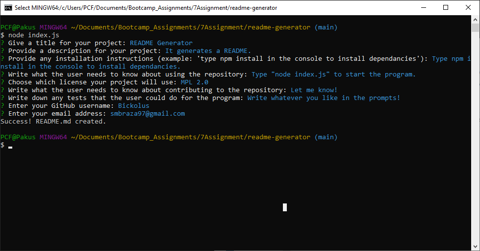

# 07: README Generator

 

## Description

This is a program that takes a bunch of user inputs and then outputs a README.md in the "outputs" folder labelled as "generated_README.nd". The user will be prompted for a couple questions, such as what the title or description of their project will be. It will also ask what kind of license the user wants their project under. It will then generate a badge based on the license the user chose. The program will also ask for the user's GitHub username and e-mail address, which will then display a link to the user's profile on GitHub. 

## Table of Contents

1. [Installation](#installation)
2. [Usage](#usage)
3. [Example](#example)
4. [License](#license)
5. [Contributing](#contributing)
6. [Questions](#questions)

## Installation

Type npm install in the console to install dependancies. This is important if you want the program to run. 

## Usage

To run the program, type "node index.js" in the command line (when you are in the directory of the index.js file) and then answer some questions. 

## Example

### Screenshot of the Program:

### Video Demonstration:

https://user-images.githubusercontent.com/96181899/153436071-cc371921-63e4-48af-ad27-b32ab6496e99.mp4

## License

Licensed under the MIT license.

## Contributing

You are allowed to improve this program. If you have any ideas how, go ahead and let me know!

## Questions

My GitHub Page: [Bickolus](https://github.com/Bickolus.org)

If you have any questions, please contact me at smbraza97@gmail.com.
